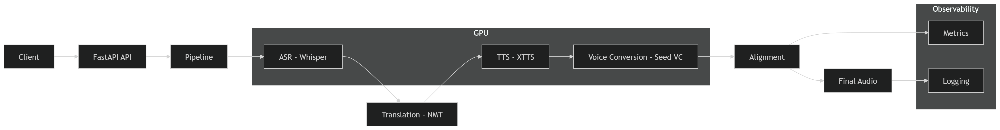

# 📊 Multilingual Speech Synthesis with Voice Cloning

An end-to-end AI-powered audio dubbing system that converts English speech into Arabic while preserving the original speaker’s tone, timing, and characteristics using ASR, NMT, TTS, and Voice Conversion.
---

## 🏗️ Architecture Diagram

System Design: FastAPI-based orchestration with GPU-accelerated ASR, TTS, and Voice Conversion modules, supported by segment-level processing and full observability.

## 🚀 Overview

This pipeline performs:

Audio → Speech-to-Text → Translation → Speech Generation → Voice Cloning → Aligned Output

**Core Components**
ASR: Whisper
NMT: Argos Translate
TTS: XTTS (Coqui)
Voice Cloning: Seed-VC
Backend: FastAPI
Framework: PyTorch
---

## ✨Features
🎙️ Cross-lingual voice cloning (English → Arabic)
⏱️ Segment-level audio alignment
⚡ Near real-time inference (~0.8–1.2 RTF)
📊 Metrics tracking (latency, sync error, GPU usage)
🌐 API-ready architecture (FastAPI)
🧾 Structured logging + JSON outputs
---

## 📁 Project Structure

.
├── input/                  # Input audio files
│   ├── audio.mp3
│
├── output/                 # Generated outputs
│   ├── arabic_output.mp3
│   ├── metrics_*.json
│   └── logs/               # Log Details
│
├── src/
│   ├── pipeline/
│   │   ├── segment.py      # Audio segmentation
│   │   ├── translate.py    # NMT translation
│   │   ├── generation.py   # TTS + VC + alignment
│   │   └── seed-vc/        # Voice conversion module
│   │
│   ├── utils/
│   │   └── logger.py       # Logging setup
│   │
│   ├── config.yaml         # Configuration file
│   ├── config.py
│   ├── api.py              # FastAPI service
│   └── main.py             # Entry point
│
├── temp_audio_segments/    # Intermediate audio chunks
├── requirements.txt
└── README.md

---

## ⚙️ Installation
---
1. Create environment
python -m venv venv
venv\Scripts\activate

2. Install dependencies
pip install -r requirements.txt

3. 🔧 System Requirements
Python 3.11
GPU (recommended)
FFmpeg installed and added to PATH

---

## ▶️ Usage

Run pipeline:
python src/main.py

Output:
🎧 Final dubbed audio → output/arabic_output.mp3
📊 Metrics → output/metrics_<run_id>.json
📝 Logs → output/logs/

---

## 🌐 API Usage (FastAPI)

---

Run server:

uvicorn src.api:app --reload

Endpoint:

POST /dub

Returns:

{
  "output": "path/to/audio",
  "metrics": {
    "latency": "...",
    "rtf": "...",
    "status": "success"
  }
}

---

## 📊 Metrics Tracked

RTF (Real-Time Factor)
Latency (API & pipeline)
Sync Error (<250ms target)
Success Rate (>95%)
GPU Memory Usage
Stage-wise timings

---

## 🧪 Example Metrics Output
{
  "execution": {
    "rtf": 0.92,
    "total_time_sec": 48.2
  },
  "quality": {
    "sync_error_sec": 0.21,
    "success_rate": 0.97
  },
  "api": {
    "latency_sec": 49.1,
    "status": "success"
  }
}
--- 

## 🧠 Technical Highlights
Transformer-based ASR + NMT pipeline
Neural TTS with speaker conditioning
Voice conversion for tone preservation
Segment-wise alignment using time-stretching & silence padding
GPU-accelerated inference with PyTorch

## 💼 Use Cases
🎬 Video dubbing
🎙️ Podcast localization
🌍 Multilingual content generation
🎧 Voice cloning applications

## 🚀 Future Improvements
Lip-sync alignment
Streaming inference
Multi-speaker support
Diffusion-based speech generation
---

## 🧑‍💻 Author

Shivam Bhatt

---

## 🧾 License

MIT License

---

## 🙏 Acknowledgements

This project was inspired in part by the article:

- Transform Voices with AI: A Complete Guide to Seed-VC (LevelUp GitConnected)

The resource offered practical insights into modern voice conversion techniques, particularly Seed-VC, which informed the design of the tone-matching and speaker-preserving components of this system.